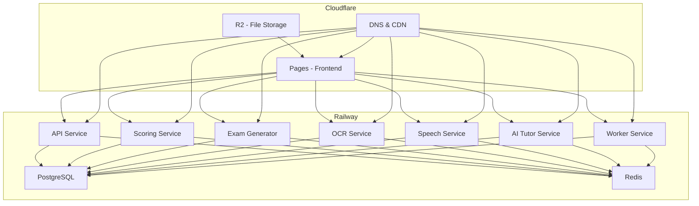

# IELTS AI Platform - Deployment Strategy Guide

## 🎯 **Recommended Strategy: Cloudflare + Railway Hybrid**

### **Why This Approach?**

Your IELTS application has complex requirements that make a single-platform deployment challenging:

- **8 Microservices** with different resource needs
- **Real-time WebSocket** connections for AI Tutor
- **AI/ML Processing** (speech analysis, OCR, scoring)
- **File Upload/Storage** requirements
- **Database & Caching** needs
- **Global Performance** requirements

## 📊 **Deployment Options Comparison**

| Platform                 | Frontend     | Backend      | Database     | File Storage | Cost | Complexity | Recommendation  |
| ------------------------ | ------------ | ------------ | ------------ | ------------ | ---- | ---------- | --------------- |
| **Cloudflare Only**      | ✅ Excellent | ❌ Limited   | ❌ No        | ✅ R2        | $    | ❌ High    | Not Recommended |
| **Railway Only**         | ✅ Good      | ✅ Excellent | ✅ Excellent | ✅ Good      | $$   | ✅ Low     | Good Option     |
| **Vercel + Railway**     | ✅ Excellent | ✅ Excellent | ✅ Excellent | ✅ Good      | $$   | ✅ Low     | Great Option    |
| **Cloudflare + Railway** | ✅ Excellent | ✅ Excellent | ✅ Excellent | ✅ Excellent | $$   | ✅ Low     | **Best Option** |
| **AWS/GCP/Azure**        | ✅ Good      | ✅ Excellent | ✅ Excellent | ✅ Excellent | $$$  | ❌ High    | Overkill        |

## 🚀 **Recommended Architecture**



## 💰 **Cost Analysis**

### **Cloudflare + Railway (Recommended)**

- **Cloudflare Pages**: Free tier (100k requests/month)
- **Cloudflare R2**: $0.015/GB/month
- **Railway**: ~$50-100/month for all services
- **Total**: ~$50-150/month

### **Vercel + Railway (Alternative)**

- **Vercel**: Free tier (100GB bandwidth/month)
- **Railway**: ~$50-100/month for all services
- **Total**: ~$50-150/month

### **Railway Only**

- **Railway**: ~$80-150/month (including frontend)
- **Total**: ~$80-150/month

## 🛠 **Implementation Steps**

### **Step 1: Backend Deployment (Railway)**

1. **Install Railway CLI**

```bash
npm install -g @railway/cli
```

2. **Login to Railway**

```bash
railway login
```

3. **Deploy Services**

```bash
# Deploy each service
cd services/api && railway up
cd ../scoring && railway up
cd ../exam-generator && railway up
cd ../ocr && railway up
cd ../speech && railway up
cd ../ai-tutor && railway up
cd ../../workers && railway up
```

4. **Setup Databases**

```bash
# Add PostgreSQL and Redis services
railway add postgresql
railway add redis
```

### **Step 2: Frontend Deployment (Cloudflare Pages)**

1. **Install Wrangler CLI**

```bash
npm install -g wrangler
```

2. **Login to Cloudflare**

```bash
wrangler login
```

3. **Deploy Frontend**

```bash
cd apps/web
npm run build
wrangler pages deploy .next --project-name=ielts-ai-platform
```

### **Step 3: File Storage (Cloudflare R2)**

1. **Create R2 Bucket**

```bash
wrangler r2 bucket create ielts-uploads
```

2. **Configure CORS**

```bash
wrangler r2 bucket cors put ielts-uploads --file r2-cors.json
```

### **Step 4: Environment Configuration**

1. **Update Environment Variables**

```bash
# In Cloudflare Pages dashboard
NEXT_PUBLIC_API_URL=https://your-railway-api.railway.app
NEXT_PUBLIC_AI_TUTOR_URL=https://your-railway-ai-tutor.railway.app
NEXT_PUBLIC_AI_TUTOR_WS_URL=wss://your-railway-ai-tutor.railway.app/ws
# ... other service URLs
```

2. **Setup API Keys**

```bash
# In Railway dashboard
OPENAI_API_KEY=your-openai-key
ANTHROPIC_API_KEY=your-anthropic-key
OPENROUTER_API_KEY=your-openrouter-key
```

## 🔧 **Alternative Deployment Options**

### **Option 1: Vercel + Railway**

- **Pros**: Excellent Next.js support, great developer experience
- **Cons**: Slightly higher cost, less global edge presence
- **Best for**: Development-focused teams

### **Option 2: Railway Only**

- **Pros**: Simpler setup, unified platform
- **Cons**: Higher cost, less optimized for frontend
- **Best for**: Teams wanting simplicity

### **Option 3: AWS/GCP/Azure**

- **Pros**: Maximum control, enterprise features
- **Cons**: High complexity, high cost
- **Best for**: Enterprise applications with specific requirements

## 📋 **Deployment Checklist**

### **Pre-Deployment**

- [ ] All services tested locally
- [ ] Environment variables documented
- [ ] API keys secured
- [ ] Database migrations ready
- [ ] File storage configured

### **Backend Deployment**

- [ ] Railway project created
- [ ] All services deployed
- [ ] Databases provisioned
- [ ] Environment variables set
- [ ] Health checks passing

### **Frontend Deployment**

- [ ] Cloudflare Pages project created
- [ ] Build process working
- [ ] Environment variables configured
- [ ] Custom domain setup (optional)
- [ ] SSL certificate active

### **Post-Deployment**

- [ ] All services accessible
- [ ] File uploads working
- [ ] WebSocket connections stable
- [ ] Performance monitoring active
- [ ] Error tracking configured

## 🚨 **Important Considerations**

### **Security**

- Use environment variables for all secrets
- Enable CORS properly
- Implement rate limiting
- Use HTTPS everywhere

### **Performance**

- Enable Cloudflare CDN
- Use Railway's auto-scaling
- Implement caching strategies
- Monitor response times

### **Monitoring**

- Set up health checks
- Monitor error rates
- Track API usage
- Monitor costs

### **Backup & Recovery**

- Regular database backups
- Service redundancy
- Disaster recovery plan
- Rollback procedures

## 🎉 **Conclusion**

The **Cloudflare + Railway hybrid approach** is the best deployment strategy for your IELTS application because it:

1. **Optimizes for Performance**: Cloudflare's global edge network
2. **Handles Complexity**: Railway's microservices support
3. **Cost-Effective**: Reasonable pricing for the features
4. **Developer-Friendly**: Easy deployment and management
5. **Scalable**: Can grow with your application needs

This approach gives you the best of both worlds: excellent frontend performance with Cloudflare and robust backend services with Railway.
