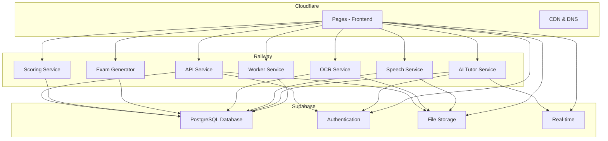

# IELTS AI Platform - Deployment Strategy with Supabase

## 🎯 **Recommended Strategy: Cloudflare + Railway + Supabase**

### **Why This Approach is Perfect:**

Your existing Supabase setup provides:

- ✅ **Managed PostgreSQL Database** (no Railway PostgreSQL needed)
- ✅ **Built-in Authentication** (Supabase Auth)
- ✅ **File Storage** (Supabase Storage)
- ✅ **Real-time Features** (Supabase Realtime)
- ✅ **Edge Functions** (for simple operations)
- ✅ **Cost-Effective** (generous free tier)

## 📊 **Updated Architecture**



## 💰 **Updated Cost Analysis**

### **Cloudflare + Railway + Supabase (Recommended)**

- **Cloudflare Pages**: Free tier (100k requests/month)
- **Railway**: ~$30-60/month (reduced - no PostgreSQL/Redis)
- **Supabase**: Free tier (500MB database, 1GB storage, 50k monthly active users)
- **Total**: ~$30-80/month (significantly lower!)

### **Comparison with Previous Options**

| Platform                            | Cost    | Complexity | Features     | Recommendation  |
| ----------------------------------- | ------- | ---------- | ------------ | --------------- |
| **Cloudflare + Railway + Supabase** | $30-80  | ✅ Low     | ✅ Excellent | **Best Option** |
| **Vercel + Railway + Supabase**     | $30-80  | ✅ Low     | ✅ Excellent | Great Option    |
| **Railway Only**                    | $80-150 | ✅ Low     | ✅ Good      | Good Option     |
| **AWS/GCP/Azure**                   | $200+   | ❌ High    | ✅ Excellent | Overkill        |

## 🛠 **Implementation Steps**

### **Step 1: Supabase Configuration**

Your Supabase is already set up! Just verify:

1. **Database Schema**: Execute `supabase/schema.sql`
2. **Environment Variables**: Update with your Supabase credentials
3. **Authentication**: Configure site URLs
4. **Storage**: Verify buckets are created

### **Step 2: Backend Services (Railway)**

Deploy only the microservices (no database needed):

```bash
# Install Railway CLI
npm install -g @railway/cli

# Login to Railway
railway login

# Deploy services (simplified - no PostgreSQL/Redis)
cd services/api && railway up
cd ../scoring && railway up
cd ../exam-generator && railway up
cd ../ocr && railway up
cd ../speech && railway up
cd ../ai-tutor && railway up
cd ../../workers && railway up
```

### **Step 3: Frontend Deployment (Cloudflare Pages)**

```bash
# Install Wrangler CLI
npm install -g wrangler

# Login to Cloudflare
wrangler login

# Deploy frontend
cd apps/web
npm run build
wrangler pages deploy .next --project-name=ielts-ai-platform
```

### **Step 4: Environment Configuration**

Update your environment variables:

```bash
# Cloudflare Pages Environment Variables
NEXT_PUBLIC_SUPABASE_URL=https://zzvskbvqtglzonftpikf.supabase.co
NEXT_PUBLIC_SUPABASE_ANON_KEY=your_anon_key_here
NEXT_PUBLIC_API_URL=https://your-railway-api.railway.app
NEXT_PUBLIC_AI_TUTOR_URL=https://your-railway-ai-tutor.railway.app
NEXT_PUBLIC_AI_TUTOR_WS_URL=wss://your-railway-ai-tutor.railway.app/ws
NEXT_PUBLIC_SCORING_URL=https://your-railway-scoring.railway.app
NEXT_PUBLIC_SPEECH_URL=https://your-railway-speech.railway.app
NEXT_PUBLIC_OCR_URL=https://your-railway-ocr.railway.app
NEXT_PUBLIC_EXAM_GENERATOR_URL=https://your-railway-exam-generator.railway.app

# Railway Environment Variables (for each service)
SUPABASE_URL=https://zzvskbvqtglzonftpikf.supabase.co
SUPABASE_ANON_KEY=your_anon_key_here
SUPABASE_SERVICE_ROLE_KEY=your_service_role_key_here
OPENAI_API_KEY=your-openai-key
ANTHROPIC_API_KEY=your-anthropic-key
OPENROUTER_API_KEY=your-openrouter-key
```

## 🔧 **Updated Service Configuration**

### **Railway Services (Simplified)**

Since you have Supabase, you only need to deploy:

1. **API Service**: Main API gateway
2. **Scoring Service**: IELTS scoring algorithms
3. **Exam Generator**: AI-powered exam creation
4. **OCR Service**: Document processing
5. **Speech Service**: Audio analysis
6. **AI Tutor Service**: Real-time tutoring
7. **Worker Service**: Background tasks

**No need for:**

- ❌ PostgreSQL (Supabase handles this)
- ❌ Redis (Supabase Realtime handles this)
- ❌ Authentication service (Supabase Auth handles this)

### **Supabase Integration**

Your services will connect to Supabase for:

- **Database Operations**: All CRUD operations
- **Authentication**: User management and sessions
- **File Storage**: Audio uploads, document storage
- **Real-time**: Live updates for AI Tutor

## 📋 **Updated Deployment Checklist**

### **Pre-Deployment**

- [x] Supabase project created and configured
- [x] Database schema executed
- [x] Authentication configured
- [x] Storage buckets created
- [ ] Environment variables documented
- [ ] API keys secured

### **Backend Deployment**

- [ ] Railway project created
- [ ] All microservices deployed (7 services)
- [ ] Environment variables set
- [ ] Supabase connection tested
- [ ] Health checks passing

### **Frontend Deployment**

- [ ] Cloudflare Pages project created
- [ ] Build process working
- [ ] Environment variables configured
- [ ] Supabase client configured
- [ ] Custom domain setup (optional)

### **Post-Deployment**

- [ ] All services accessible
- [ ] Supabase connection working
- [ ] Authentication flow working
- [ ] File uploads working
- [ ] Real-time features working

## 🚨 **Supabase-Specific Considerations**

### **Security**

- Use Row Level Security (RLS) policies
- Configure proper CORS settings
- Use service role key only on backend
- Enable email confirmations

### **Performance**

- Use Supabase's connection pooling
- Implement proper indexing
- Use real-time subscriptions efficiently
- Monitor query performance

### **Storage**

- Configure proper bucket policies
- Set up file size limits
- Implement proper file cleanup
- Use CDN for file delivery

## 🎉 **Benefits of This Approach**

1. **Cost Savings**: ~50% reduction in monthly costs
2. **Simplified Setup**: No database management needed
3. **Built-in Features**: Auth, real-time, storage included
4. **Better Performance**: Supabase's optimized PostgreSQL
5. **Easier Maintenance**: Fewer services to manage
6. **Scalability**: Supabase handles database scaling

## 🔄 **Migration from Current Setup**

If you're currently using local PostgreSQL:

1. **Export Data**: Backup your current database
2. **Import to Supabase**: Use Supabase's import tools
3. **Update Connection Strings**: Point services to Supabase
4. **Test Thoroughly**: Verify all functionality works
5. **Deploy**: Use the simplified Railway deployment

This approach gives you the best of all worlds: excellent performance, cost-effectiveness, and simplicity!
