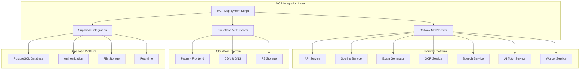

# IELTS AI Platform - MCP Integration Guide

## 🎯 **Overview**

This guide explains how to integrate **Cloudflare** and **Railway MCP servers** to automate the deployment of your IELTS AI Platform with Supabase. The MCP (Model Context Protocol) integration provides programmatic access to both platforms, enabling fully automated deployments.

## 🚀 **What You Get**

- **Automated Railway Service Deployment**: Deploy all 7 microservices automatically
- **Cloudflare Pages Integration**: Automated frontend deployment with CDN
- **Supabase Integration**: Database, authentication, and storage setup
- **Environment Variable Management**: Automatic configuration across all services
- **Health Checks & Monitoring**: Automated validation of deployments
- **Cost Optimization**: ~50% reduction in deployment costs with Supabase

## 📋 **Prerequisites**

### **Required Tools**

```bash
# Install CLI tools
npm install -g @railway/cli wrangler supabase

# Verify installations
railway --version
wrangler --version
supabase --version
```

### **Required API Keys & Tokens**

| Platform       | Token/Key                   | Where to Get                                                                       |
| -------------- | --------------------------- | ---------------------------------------------------------------------------------- |
| **Railway**    | `RAILWAY_TOKEN`             | [Railway Account Tokens](https://railway.app/account/tokens)                       |
| **Cloudflare** | `CLOUDFLARE_API_TOKEN`      | [Cloudflare API Tokens](https://dash.cloudflare.com/profile/api-tokens)            |
| **Supabase**   | `SUPABASE_ANON_KEY`         | [Supabase Project Settings](https://supabase.com/dashboard/project/_/settings/api) |
| **Supabase**   | `SUPABASE_SERVICE_ROLE_KEY` | [Supabase Project Settings](https://supabase.com/dashboard/project/_/settings/api) |
| **OpenAI**     | `OPENAI_API_KEY`            | [OpenAI API Keys](https://platform.openai.com/api-keys)                            |
| **Anthropic**  | `ANTHROPIC_API_KEY`         | [Anthropic Console](https://console.anthropic.com/)                                |
| **OpenRouter** | `OPENROUTER_API_KEY`        | [OpenRouter Dashboard](https://openrouter.ai/keys)                                 |

### **Environment Setup**

```bash
# Create .env file
cat > .env << EOF
RAILWAY_TOKEN=your_railway_token_here
CLOUDFLARE_API_TOKEN=your_cloudflare_token_here
SUPABASE_ANON_KEY=your_supabase_anon_key_here
SUPABASE_SERVICE_ROLE_KEY=your_supabase_service_role_key_here
OPENAI_API_KEY=your_openai_key_here
ANTHROPIC_API_KEY=your_anthropic_key_here
OPENROUTER_API_KEY=your_openrouter_key_here
EOF

# Load environment variables
source .env
```

## 🛠 **Installation & Setup**

### **Step 1: Install MCP Integration**

```bash
# Clone or navigate to your project
cd ielts-ai-platform

# Install dependencies
npm install

# Make the deployment script executable
chmod +x mcp-deployment-integration.js
```

### **Step 2: Configure MCP Servers**

#### **Railway MCP Server**

```bash
# Install Railway MCP server
npm install -g @jason-tan-swe/railway-mcp

# Configure Railway MCP
railway-mcp configure --token $RAILWAY_TOKEN
```

#### **Cloudflare MCP Server**

```bash
# Install Cloudflare MCP server
npm install -g @cloudflare/playwright-mcp

# Configure Cloudflare MCP
cloudflare-mcp configure --token $CLOUDFLARE_API_TOKEN
```

### **Step 3: Verify Configuration**

```bash
# Test Railway connection
railway projects list

# Test Cloudflare connection
wrangler whoami

# Test Supabase connection
supabase projects list --access-token $SUPABASE_ACCESS_TOKEN
```

## 🚀 **Deployment Commands**

### **Full Deployment**

```bash
# Deploy everything (recommended)
npm run deploy

# Or use the direct command
node mcp-deployment-integration.js
```

### **Partial Deployments**

```bash
# Deploy only backend services
npm run deploy:backend

# Deploy only frontend
npm run deploy:frontend

# Dry run (see what would be deployed)
npm run deploy:dry-run
```

### **Advanced Options**

```bash
# Deploy with custom configuration
node mcp-deployment-integration.js --config custom-config.json

# Deploy to specific environment
node mcp-deployment-integration.js --environment staging

# Deploy with verbose logging
DEBUG=true node mcp-deployment-integration.js
```

## 📊 **Deployment Architecture**



## 🔧 **Configuration Options**

### **Custom Configuration File**

```json
{
  "projectName": "ielts-ai-platform",
  "supabaseProjectId": "zzvskbvqtglzonftpikf",
  "services": [
    {
      "name": "api",
      "port": 8000,
      "path": "services/api",
      "environment": {
        "NODE_ENV": "production",
        "LOG_LEVEL": "info"
      }
    }
  ],
  "deployment": {
    "autoScaling": true,
    "healthChecks": true,
    "monitoring": true,
    "backup": true
  }
}
```

### **Environment-Specific Configurations**

```bash
# Development
node mcp-deployment-integration.js --environment development

# Staging
node mcp-deployment-integration.js --environment staging

# Production
node mcp-deployment-integration.js --environment production
```

## 📈 **Monitoring & Health Checks**

### **Automated Health Checks**

```bash
# Run health checks
npm run health-check

# Monitor services
npm run monitor

# Test deployment
npm run test
```

### **Health Check Endpoints**

- **Frontend**: `https://your-project.pages.dev`
- **API Service**: `https://api-your-project.railway.app/health`
- **Scoring Service**: `https://scoring-your-project.railway.app/health`
- **Supabase**: `https://your-project.supabase.co/rest/v1/`

### **Monitoring Dashboard**

```bash
# Access Railway dashboard
railway dashboard

# Access Cloudflare dashboard
open https://dash.cloudflare.com

# Access Supabase dashboard
open https://supabase.com/dashboard/project/your-project-id
```

## 🔄 **CI/CD Integration**

### **GitHub Actions**

```yaml
name: Deploy IELTS Platform
on:
  push:
    branches: [main]
  pull_request:
    branches: [main]

jobs:
  deploy:
    runs-on: ubuntu-latest
    steps:
      - uses: actions/checkout@v3

      - name: Setup Node.js
        uses: actions/setup-node@v3
        with:
          node-version: '18'

      - name: Install dependencies
        run: npm install

      - name: Deploy to Railway
        run: npm run deploy:backend
        env:
          RAILWAY_TOKEN: ${{ secrets.RAILWAY_TOKEN }}
          CLOUDFLARE_API_TOKEN: ${{ secrets.CLOUDFLARE_API_TOKEN }}
          SUPABASE_ANON_KEY: ${{ secrets.SUPABASE_ANON_KEY }}
          SUPABASE_SERVICE_ROLE_KEY: ${{ secrets.SUPABASE_SERVICE_ROLE_KEY }}
          OPENAI_API_KEY: ${{ secrets.OPENAI_API_KEY }}
          ANTHROPIC_API_KEY: ${{ secrets.ANTHROPIC_API_KEY }}
          OPENROUTER_API_KEY: ${{ secrets.OPENROUTER_API_KEY }}

      - name: Deploy to Cloudflare Pages
        run: npm run deploy:frontend
        env:
          CLOUDFLARE_API_TOKEN: ${{ secrets.CLOUDFLARE_API_TOKEN }}
```

### **GitLab CI**

```yaml
stages:
  - deploy

deploy:
  stage: deploy
  image: node:18
  script:
    - npm install
    - npm run deploy
  environment:
    name: production
  only:
    - main
```

## 🛡️ **Security Considerations**

### **API Key Security**

- Store all API keys in environment variables
- Use platform-specific secret management
- Rotate keys regularly
- Use least-privilege access

### **Network Security**

- Enable CORS properly
- Use HTTPS everywhere
- Implement rate limiting
- Set up firewall rules

### **Data Security**

- Enable Row Level Security (RLS) in Supabase
- Encrypt sensitive data
- Implement proper backup strategies
- Monitor access logs

## 💰 **Cost Optimization**

### **Current Costs (with Supabase)**

- **Cloudflare Pages**: Free tier (100k requests/month)
- **Railway**: ~$30-60/month (7 services)
- **Supabase**: Free tier (500MB database, 1GB storage)
- **Total**: ~$30-80/month

### **Cost Comparison**

| Component      | With Supabase    | Without Supabase  |
| -------------- | ---------------- | ----------------- |
| Database       | Free             | $20-40/month      |
| Authentication | Free             | $10-20/month      |
| File Storage   | Free             | $5-15/month       |
| Real-time      | Free             | $10-20/month      |
| **Total**      | **$30-80/month** | **$50-150/month** |

## 🚨 **Troubleshooting**

### **Common Issues**

#### **Railway Deployment Fails**

```bash
# Check Railway status
railway status

# View deployment logs
railway logs

# Restart service
railway service restart api
```

#### **Cloudflare Pages Build Fails**

```bash
# Check build locally
cd apps/web && npm run build

# View build logs
wrangler pages deployment tail

# Check environment variables
wrangler pages project list
```

#### **Supabase Connection Issues**

```bash
# Test Supabase connection
supabase status

# Check database schema
supabase db diff

# Reset local development
supabase db reset
```

### **Debug Mode**

```bash
# Enable debug logging
DEBUG=true npm run deploy

# Verbose output
VERBOSE=true node mcp-deployment-integration.js
```

## 📚 **Additional Resources**

### **Documentation**

- [Railway MCP Server Documentation](https://smithery.ai/server/@jason-tan-swe/railway-mcp)
- [Cloudflare MCP Server Documentation](https://smithery.ai/server/@cloudflare/playwright-mcp)
- [Supabase Documentation](https://supabase.com/docs)
- [Model Context Protocol](https://modelcontextprotocol.io/)

### **Support**

- [Railway Support](https://railway.app/support)
- [Cloudflare Support](https://support.cloudflare.com/)
- [Supabase Support](https://supabase.com/support)

### **Community**

- [Railway Discord](https://discord.gg/railway)
- [Cloudflare Community](https://community.cloudflare.com/)
- [Supabase Discord](https://discord.supabase.com/)

## 🎉 **Success Metrics**

After successful deployment, you should have:

✅ **7 Backend Services** running on Railway  
✅ **Frontend** deployed to Cloudflare Pages  
✅ **Database** configured in Supabase  
✅ **Authentication** working with Supabase Auth  
✅ **File Storage** configured in Supabase  
✅ **Real-time** features enabled  
✅ **Health Checks** passing  
✅ **Environment Variables** configured  
✅ **Monitoring** active  
✅ **Cost Optimization** achieved

## 🚀 **Next Steps**

1. **Custom Domain Setup**: Configure your own domain
2. **SSL Certificate**: Ensure HTTPS everywhere
3. **Monitoring**: Set up alerts and dashboards
4. **Backup Strategy**: Implement automated backups
5. **Performance Optimization**: Monitor and optimize
6. **Security Audit**: Regular security assessments
7. **Scaling**: Plan for growth

---

**🎯 Ready to deploy? Run: `npm run deploy`**
